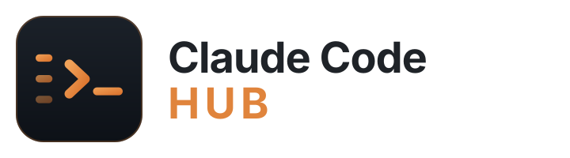

<p align="center">
  
</p>

# Claude Code Hub

> Jedno okno kolem Claude Code — projekty v postranním panelu, každý otevřený jako vlastní tab se skutečným terminálem. Linux, Windows i macOS z jednoho kódu.

**Repo je jen instalačka.** Žádná data, žádné projekty, žádná paměť, žádné přihlašovací
údaje. Instalátor se podívá, co máš na disku ty, zapíše to do `~/.claude/hub-config.json`
a aplikace i slash příkazy pak čtou odtud.

📂 **Kolekce:** Ostatní
🖥 **Platforma:** Linux · Windows 10/11 · macOS
👤 **Autor:** [@jurapascal](https://github.com/jurapascal)

---

## O projektu

Claude Code se normálně spouští v terminálu, jeden projekt = jedno okno. Hub z toho
dělá jednu aplikaci:

- **Postranní panel** — seznam projektů z nastavených složek (typ, branch, počet
  nezacommitovaných souborů), hledání, tlačítko na libovolnou jinou složku.
  Pravý klik na projekt = Deploy, shell, otevřít složku.
- **Taby** — klik na projekt otevře **skutečný terminál** (pty + xterm.js), takže TUI
  Claude Code vypadá přesně jako v terminálu. Když session skončí, tab zůstane jako
  obyčejný shell. Taby jdou přejmenovat dvojklikem a přetáhnout myší.
- **Bublina místo vstupního řádku** — spodek terminálu, kde Claude Code kreslí
  svoje vstupní pole, překryje chatovací bublina: pole na text, přepínač modelu,
  slash příkazy, příloha a režimy (Shift+Tab, Esc). Odeslané jde do stejného pty,
  takže Claude dostane přesně to, co by dostal z klávesnice. Jakmile se dole
  objeví dialog (výběr modelu, dotaz na oprávnění) nebo se odroluje nahoru,
  bublina se sama složí do proužku — nikdy nezakryje to, na co se máš dívat.
- **Dotaz jako karta** — když se Claude Code na něco ptá (důvěra ke složce, povolení
  příkazu nebo úpravy souboru), přenese se otázka z terminálu do karty přes celé okno:
  nadpis, text, příkaz nebo diff v rámečku a volby jako tlačítka. Odpovídá se myší
  i klávesnicí — terminál pod tím poslouchá dál. Tlačítkem **Terminál** jde karta
  odsunout a podívat se, jak dotaz nakreslil Claude Code.
- **Paměť se ukládá sama** — na nic se neklikne a `/save` ani `/project` psát
  nemusíš. Když se tab zavře, session skončí nebo je 20 minut ticho, Claude na
  pozadí projde, co se v konverzaci dělo, doplní poznámku k projektu (historie,
  TODO) a jen když to stojí za to, i jeden poznatek, chybu nebo úspěch. Hub pak
  ukáže hlášku „Paměť doplněna". Víc v [Paměť se ukládá sama](#paměť-se-ukládá-sama).
- **Zavření tabu se neptá** — do paměti se session uloží sama, takže křížek prostě
  zavře. Zeptá se jen tehdy, když agent zrovna pracuje a zavřením by se to utnulo.
- **Akční panel vpravo** — u tabu s Claude Code tlačítka posílají do chatu slash
  příkazy (`/status`, `/screenshot`, ve vývojářském režimu `/deploy` a `/push`).
  U holého terminálu se neukazuje, tam by příkaz skončil v bashi.
- **Reload nezabíjí session** — terminály běží v serveru, ne ve stránce. Když se okno
  načte znovu, hub se připojí zpátky k běžícím Claude session a dohraje jejich výpis.
- **Obrázky** — screenshot ze schránky (Ctrl+V) nebo soubor přetažený do tabu se uloží
  a do promptu se vypíše jeho cesta, takže si ho Claude rovnou přečte.
- **Diakritika** — háčky a čárky chodí přes vstupní metodu systému jako composition
  events; hub je bere na sebe (`hub/static/ime.js`), protože xterm.js je při rychlejším
  psaní slepuje a do řádku pak teče nashromážděný balast.
- **Průvodce prvním spuštěním** — vzhled, složky s projekty, kde bydlí paměť
  a jak se zálohuje. Umí napojit **existující Obsidian vault** (najde si ho sám,
  Obsidian si seznam vede) i stáhnout ho z gitu. Kdykoli později totéž pod ⚙.
- **Dvě „+" tlačítka** — nový tab s Claude Code, nebo holý terminál. V nastavení
  se dá kterékoli schovat.
- **Správa projektů** — u každého `⋯` s možnostmi: přejmenovat, zařadit do
  skupiny, dát fotku, přiřadit GitHub repo (samo se načte z `git remote`),
  archivovat, odebrat z panelu (složka na disku zůstane). Přidat se dá i složka
  mimo nastavené cesty.
- **Briefing projektu** — napíšeš vlastními slovy, o co jde, a uloží se do
  `CLAUDE.md` projektu, takže si to Claude Code přečte sám, jakmile ho otevřeš.
  Do cizího obsahu se nesahá, blok je ohraničený značkami. `/brief` z něj pak
  vytáhne strukturovaná fakta do poznámky v paměti.
- **Uvítání** — scéna podle denní doby, kde se naposledy dělalo, co zůstalo
  rozdělané a pár čísel o používání.
- **Statistiky** — kolik tokenů, kdy během dne píšeš, které projekty berou
  nejvíc, a commity z GitHubu. Počítá se z toho, co si Claude Code ukládá do
  `~/.claude`; nic se nikam neposílá.
- **Napojení (MCP)** — v nastavení je vidět, na co Claude Code dosáhne: konektory
  z účtu claude.ai i servery zaregistrované na stroji, u každého jestli opravdu
  odpovídá. Nečte se jen registrace — každý server se osloví, takže je poznat
  i ten, který je sice zapsaný, ale chce přihlásit. Pod seznamem je **katalog**:
  Google Workspace, Context7, Fetch, souborový systém, paměť, Clockify a další
  se napojí kliknutím — buď globálně, nebo jen do jedné složky.
- **Nastavení po sekcích** — vzhled, projekty, taby, paměť, napojení, aktualizace
  a logy se přepínají tlačítky vlevo; vybraná sekce se pamatuje.
- **Prostor na serveru** — při startu si vybereš, jestli pracovat na počítači,
  nebo se přihlásit ke svému prostoru na serveru s bránou. Adresa se ověří,
  přihlásíš se e-mailem a heslem a appka se příště otevře rovnou tam — se
  vším, co v prostoru máš. Podrobně níž.
- **Bez klíče API** — Claude v prostoru jede na vlastním předplatném Claude
  každého člověka. Appka ho propojí sama při prvním vstupu do prostoru,
  v prohlížeči stačí kliknout na Authorize.
- **Claude ze serveru na počítači** — Claude v prostoru na serveru sahá i na
  počítač, ze kterého se k prostoru přihlásíš: čte a hledá soubory, zapisuje,
  spouští příkazy a kopíruje soubory mezi počítačem a serverem. Zapíná se na
  počítači (vypnuto / jen čtení / plný přístup) a běží, dokud je appka
  otevřená. Když je počítač vypnutý, nechá mu Claude úkol na později — po
  zapnutí ho dodělá Claude v tabu na počítači. Podrobně v
  [Claude ze serveru na tvém počítači](#claude-ze-serveru-na-tvém-počítači).
- **Telefon** — hub se dá přes Tailscale otevřít i z mobilu (Android i iPhone):
  QR kód v nastavení, ikona na ploše, šuplík místo panelu a řádek kláves,
  ze kterého jde poslat Esc, Tab i šipky. Podrobně níž.
- **Dark/light** — řídí se motivem systému, přepínač v hlavičce.
- **Obsidian (volitelné)** — když máš vault, panel ukáže **Osobní Obsidian**
  s posledními poznámkami (learnings/errors/wins); na serveru k tomu **Firemní**
  a **Sdílené**. Poznámky jde v hubu i psát: editor se živým náhledem jako
  v Obsidianu ([[odkazy]] s našeptáváním, ==zvýraznění==, #štítky, úkoly) a graf
  poznámek s barvami a nastavením jako v originále. Vložené obrázky jsou vidět
  i při psaní. Na serveru jsou v liště dva taby — **Claude Code osobní**
  a **Claude Code firemní**; ve firemním Claude čte z firemního Obsidianu
  a zapisuje do něj rovnou, bez ptaní (osobní poznámky, hesla a napojení tam
  ale nepatří a hub je sám nenahraje). Osobní se ukládá samo a jde v něm poznámku **přejmenovat**
  (odkazy se opraví samy) i **smazat** (do koše `.trash` v trezoru); do
  firemního a sdílených se změna potvrzuje kartou. Bez vaultu se sekce
  vůbec nezobrazí.

## Jak to funguje

Okno je tenká slupka kolem lokální web appky — díky tomu je UI na všech systémech
jedno a totéž a liší se jen dvě věci pod ním:

```
  okno (chromium --app / WebKitGTK / prohlížeč)      telefon (PWA nebo .apk)
        │  http + websocket, jen 127.0.0.1, na token       │  https, jen v tailnetu
        │                                                  │
        └──────────────►  Python server  ◄─────────────────┘
                            (stdlib)  │
                                      ▼
                            pty ──► bash ──► claude
                             ├─ Linux/macOS: modul `pty` ze standardní knihovny
                             └─ Windows:     ConPTY přes pywinpty
```

- Server poslouchá **jen na 127.0.0.1** na náhodném portu a každý požadavek musí mít
  token, který se generuje při startu a předává se oknu v URL. Zvenčí se k němu nedá
  dostat.
- **Telefon** je druhý listener, který vzniká, jen když si ho zapneš — uvnitř
  [Tailscale](https://tailscale.com) sítě, s vlastním dlouhodobým tokenem.
  Podrobně v sekci [Telefon](#telefon-android-i-iphone).
- **Windows jede na Git for Windows** — `claude-wrapper.sh` i bashové slash příkazy
  (`/deploy`, `/ftp`, `/audit`) tak běží beze změny na všech systémech.
- Terminál je [xterm.js](https://xtermjs.org) přibalený v repu (`hub/static/vendor/`),
  nic se nestahuje z internetu za běhu.

## Požadavky

| Co | Proč | Kde |
|---|---|---|
| Python 3.9+ | běh aplikace (jinak jen standardní knihovna) | všude |
| [Claude Code CLI](https://code.claude.com/docs/en/setup) | vlastní účet, viz níže | všude |
| [Git for Windows](https://git-scm.com/downloads/win) | dodává `bash.exe` — bez něj se tab neotevře | **Windows (povinné)** |
| `pywinpty` | ConPTY terminál; instalačka ho doinstaluje sama | Windows |
| chromium / WebKitGTK | okno bez adresního řádku (jinak se hub otevře jako záložka) | Linux, macOS |
| Node.js 20+ | jen pro volitelný Playwright MCP | všude |
| [Obsidian](https://obsidian.md/download) | paměť (`/save`, `/learn`, `/project`) a panel poznámek | volitelné, všude |
| [GitHub CLI](https://github.com/cli/cli#installation) | `gh auth login` → klonování a `/push` z čerstvého stroje | volitelné, všude |

Na Linuxu **už není potřeba GTK 3 ani VTE**. Chceš-li nativní okno bez prohlížeče:

```bash
sudo apt install gir1.2-webkit2-4.1     # nebo prostě chromium
```

## Instalace

Jeden řádek — ale **na každém systému jiný**. Windows má PowerShell, ne bash:
`curl -fsSL … | bash` tam skončí na `A parameter cannot be found that matches
parameter name 'fsSL'`, protože `curl` je v PowerShellu jenom jiné jméno pro
`Invoke-WebRequest`.

### Linux a macOS

```bash
curl -fsSL https://raw.githubusercontent.com/jurapascal/claude-code-hub/main/get.sh | bash
```

### Windows

V PowerShellu (**bez** práv správce):

```powershell
irm https://raw.githubusercontent.com/jurapascal/claude-code-hub/main/get.ps1 | iex
```

Obojí stáhne repo do `~/.claude/hub-src` a spustí instalačku. Podruhé spuštěný
stejný příkaz hub **zaktualizuje**.

Zástupce **Claude Code** v nabídce Start spouští `pythonw.exe`, takže se vedle okna
neotevírá černá konzole; kdyby okno zůstalo prázdné, důvod je v
`%USERPROFILE%\.claude\hub.log`.

### Windows — co k tomu patří

| Co | Proč |
|---|---|
| **Git for Windows** | dodává `bash.exe`, na kterém stojí každý tab a všechny slash příkazy — bez něj se tab neotevře |
| **pywinpty** | ConPTY terminál; instalačka ho doinstaluje sama |
| **Python 3.9+** | běh aplikace |

Zástupce **Claude Code** v nabídce Start spouští `pythonw.exe`, takže se vedle
okna neotevírá černá konzole. Schránka jede přes `Get-Clipboard` a `clip`;
`PRIMARY` (výběr myší) Windows nezná, takže tam prostřední tlačítko nevkládá.
Napojení paměti používá **křižovatku** (`mklink /J`), ne symlink — ten by chtěl
práva správce nebo vývojářský režim.

Kdyby okno zůstalo prázdné, důvod je v `%USERPROFILE%\.claude\hub.log`.

Když si chceš ověřit, že na tvém stroji sedí i to, co se z Linuxu vyzkoušet
nedá (odkazy na složku, ConPTY, jméno složky s pamětí), spusť:

```powershell
powershell -ExecutionPolicy Bypass -File "$env:USERPROFILE\.claude\tools\windows-check.ps1"
```

### Z klonu

```bash
git clone https://github.com/jurapascal/claude-code-hub.git
cd claude-code-hub
bash install.sh                                          # Linux / macOS
powershell -ExecutionPolicy Bypass -File install.ps1     # Windows
```

### Co instalačka udělá

Zapíše, kde máš projekty a paměť, do `~/.claude/hub-config.json`, nakopíruje appku
do `~/.claude/` a vyrenderuje slash příkazy. Existující soubory zálohuje
(`*.backup-<datum>`).

Všechno, bez čeho by hub sice běžel, ale nebylo by s ním co dělat, **doinstaluje
sama** — otázka navíc byla hlavní důvod, proč instalace nebyla rychlá:

| Nasadí | Co udělá |
|---|---|
| **Obsidian** | `winget install Obsidian.Obsidian`, na Linuxu flatpak z Flathubu (jinak snap), na macOS `brew --cask` |
| **vault** | naklonuje ten tvůj z gitu, nebo založí `~/Obsidian/Claude-Brain` s `memory/`, `skills/` a rozcestníkem `MEMORY.md` — teprve tím se zapnou `/save`, `/learn`, `/project`, `/skill` |
| **GitHub CLI** | `winget install GitHub.cli` / apt / dnf / pacman / snap / brew, pak `gh auth login` + `gh auth setup-git` |
| **Playwright MCP** | prohlížeč pro Claude Code (~115 MB, potřebuje Node.js 20+) |
| **Clockify MCP** | volitelně, jen když zadáš API klíč (nebo ho máš v `CLOCKIFY_API_KEY`) |
| **hooky** | `Stop` (uloží stav session) a `SessionStart` (načte kategorie skillů z vaultu a stav minulé session) do `settings.json` |
| **skilly** | 571 hotových postupů z [claude-brain-skills](https://github.com/jurapascal/claude-brain-skills) do vaultu — existující složku nikdy nepřepíše |

Zeptá se jen na to, co uhádnout nejde:

- **kde máš paměť** — adresa vault repa, nebo Enter a založí prázdný,
- **bypass režim** — jestli má Claude přestat ptát se na potvrzení u každého
  příkazu a úpravy souboru. Rychlejší, ale běží bez brzdy; zapínej to jen na
  vlastním stroji. Kdykoli později `/permissions`.
- **přihlášení** do GitHubu a do Claude Code.

`settings.json` je tvůj: instalačka do něj jen **přidá**, co chybí, předtím ho
zazálohuje a vlastního hooku na stejnou událost se nedotkne. Rozbitý JSON nechá být.

| Přepínač | Co udělá |
|---|---|
| `--yes` / `-Yes` | bez otázek — doinstaluje, co jde, přihlášení a bypass přeskočí |
| `--minimal` | jen hub: nic nedoinstalovává, do `settings.json` nesahá |

Když něco nehraje:

```bash
python3 ~/.claude/claude-hub.py --doctor     # co na tomhle stroji je a co chybí
```

## Slash příkazy

Instalátor je vyrenderuje do `~/.claude/skills/<jméno>/SKILL.md` — **odsud si je
Claude Code 2.1+ načítá**; starší složka `~/.claude/commands/*.md` se v tomhle buildu
ignoruje (příkazy odtud hlásí „Unknown command"). Cesty v nich nejsou natvrdo, doplní
se z tvého konfigu při instalaci.

| Příkaz | Co dělá | Potřebuje vault |
|---|---|---|
| `/save` | uloží, co jsme právě dělali, jako poznámku do paměti | ✅ |
| `/learn <popis>` | uloží poznatek / chybu / úspěch podle klíčových slov | ✅ |
| `/project` | založí nebo aktualizuje poznámku k aktuálnímu projektu | ✅ |
| `/skill <název>` | načte skill z vaultu | ✅ |
| `/deploy` | nasadí projekt — FTP (`.ftp-deploy.json`) nebo git, auto-detekce | — |
| `/ftp` | FTP/FTPS/SFTP deploy, poprvé si vyžádá údaje | — |
| `/push` | commit + push na GitHub (nikdy force) | — |
| `/status` | přehled projektů a jejich git stavů | — |
| `/screenshot <url>` | screenshot webu (desktop + mobil) | — |
| `/audit <url>` | vizuální a technický audit webu | — |

`/save` a `/project` zůstávají pro ruční použití, ale potřeba nejsou: paměť se
ukládá sama (viz níž). Bez vaultu se čtyři paměťové příkazy vůbec neinstalují. Vlastní příkazy si přidáš jako další složku do `~/.claude/skills/`;
instalátor je nemaže.

## Paměť se ukládá sama

Dokud to bylo tlačítko, uložilo se jen to, na co si člověk vzpomněl. Teď to dělá
hook `hooks/memory-autosave.py`, který instalačka zapojí do `settings.json`
(vedle tvých vlastních hooků, nic nepřepíše):

| Kdy | Co se stane |
|---|---|
| Claude dopíše odpověď (`Stop`) | zapíše si, že session žije, a hlídá, až ztichne |
| 20 minut ticha | uloží, co od minula přibylo |
| `/exit`, `/clear`, Ctrl+D (`SessionEnd`) | uloží hned |
| zavřený tab nebo celé okno hubu | uloží session z toho tabu |

Uložení samo: z přepisu konverzace se poskládá výtah (zadání, co Claude
odpověděl, příkazy, commity, upravené soubory; strop 60 kB, i z přepisu o 5 MB
vyjde kolem 20 kB). Pak se na pozadí pustí `claude -p` bez okna, který podle
výtahu **doplní poznámku k projektu** (založí ji, když chybí) a jen když
se objevilo něco, co stojí za zapamatování, zapíše **jeden poznatek, chybu nebo
úspěch**. Nic nezdvojuje: napřed hledá existující poznámku a každý kus
konverzace zpracuje jednou.

Aby to nebyla otrava ani díra do rozpočtu:

- **Drobnost se neukládá.** Otázka s odpovědí nebo samotné `/save` se přeskočí,
  aniž by se model vůbec volal.
- **Podřízený Claude je zavřený v paměti.** Běží bez hooků (`disableAllHooks`,
  jinak by jeho konec spustil ukládání znovu a třeba i zápis do Clockify), bez
  MCP, bez uložené session, jen s nástroji Read/Write/Edit/Glob/Grep. Zapisovat
  smí jen do složky paměti.
- **Cena:** jedno uložení změřené na skutečné session (model `sonnet`, zhruba
  100 s) vyšlo na $0,31–0,38. Strop je $3 (`--max-budget-usd`).
- **Vypnout** jde v ⚙ → Paměť. Tam je vidět i posledních pár uložení a co se zapsalo.

Stav leží v `~/.claude/hub-autosave/`: kam až se u které session došlo, a
v `log.jsonl` výsledky, ze kterých hub bere hlášku. Session v tabu se pozná podle
proměnné `HUB_TAB`, kterou hub dá každému tabu a Stop hook si ji zapíše.

## Telefon (Android i iPhone)

Hub běží dál na počítači — telefon je jen jeho okno. Claude Code je program nad
tvými soubory na disku, na iOS ho spustit nejde vůbec a na Androidu jen přes
Termux, takže „appka, co si nese Claudea s sebou" neexistuje. Zato UI hubu je
web, takže z mobilu vypadá a chová se stejně: projekty, běžící session, bublina
i karta s dotazem.

**Cesta dovnitř vede přes [Tailscale](https://tailscale.com)** — privátní síť
mezi tvými zařízeními. Na routeru se nic neotvírá, ven z tvé sítě nevede žádný
port a funguje to i z mobilních dat.

### Nastavení (jednou)

1. Nainstaluj Tailscale na počítač i na telefon a přihlas se na obou stejným
   účtem. Na počítači potom:

   ```bash
   tailscale up
   sudo tailscale set --operator=$USER    # aby hub směl sám nastavit `tailscale serve`
   ```

2. V hubu **Nastavení → Telefon → Zapnout přístup z telefonu**.
3. Ukáže se QR kód. Namiř na něj foťák telefonu a otevři odkaz.
4. V prohlížeči dej **Sdílet → Přidat na plochu**. Hub se od té chvíle otevírá
   jako aplikace na celou obrazovku a token si drží v cookie, takže se QR
   skenuje jenom poprvé.

### Jak se to připojuje

Hub zkusí dvě cesty a použije tu první, která projde:

| | Adresa | Kdy |
|---|---|---|
| `tailscale serve` | `https://<stroj>.<tailnet>.ts.net` | běžně — tailscaled drží certifikát, takže Android nabídne plnou instalaci na plochu |
| přímý bind | `http://100.x.y.z:8760` | když tailnet nemá zapnuté HTTPS certifikáty nebo `serve` nesmí běžet pod tvým účtem |

V obou případech poslouchá jen uvnitř tailnetu a každý požadavek musí mít token.
Okno na počítači si dál mluví se svým vlastním serverem na `127.0.0.1` —
zapnutí ani vypnutí telefonu se běžících session nedotkne.

**Na mobilu navíc:** postranní panel je šuplík, nad bublinou je řádek kláves
(Esc, Tab, ⇧Tab, ^C, šipky, ⏎ — z měkké klávesnice se jinak nezmáčknou),
podržení karty projektu zastupuje pravé tlačítko a když vyjede klávesnice,
terminál se přepočítá.

**Zaškrtávátko „nechat hub běžet i po zavření okna"** je tam kvůli tomu, že hub
se normálně vypne, jakmile se zavře poslední okno. Bez něj by se z telefonu
nebylo kam připojit, dokud si někdo u počítače hub nespustí.

### Aplikace pro Android (.apk)

PWA na plochu stačí, ale kdo chce skutečnou instalačku, najde v
[`mobile/android/`](mobile/android) tenký obal (WebView + čtečka QR).
Sestaví se v GitHub Actions (**Actions → Android APK → Run workflow**), hotové
APK je pak ke stažení jako artefakt. Lokálně stačí Android SDK a `gradle
assembleRelease`.

Na iPhonu žádná .ipa nebude — bez placeného účtu Apple Developer se aplikace do
telefonu nedostane a PWA na ploše umí přesně totéž.

## Prostor na serveru

Hub nemusí běžet jen na počítači. Na serveru s [bránou](gateway/README.md) má
každý svůj **prostor** — vlastní projekty, paměť, napojení i session Claude
Code — a appka se do něj umí přihlásit:

1. Při prvním spuštění vyber **Na serveru** (nebo kdykoli později ⚙ → *Účet*).
2. Napiš adresu serveru a klikni **Ověřit**. Appka se brány zeptá, jestli je
   to opravdu server Code Hubu — heslo tak neodejde na překlepnutou adresu,
   kde běží něco jiného.
3. Přihlas se e-mailem a heslem od správce serveru → **Otevřít můj prostor**.

Příště se appka otevře **rovnou ve tvém prostoru**. Když server neodpovídá nebo
přihlášení vypršelo, řekne proč a nabídne *Zkusit znovu*, přihlášení, nebo
*Pracovat na tomto počítači*. Na serveru svítí v hlavičce štítek **SERVER**;
klik na něj otevře *Účet*, odkud se vrátíš na počítač nebo odhlásíš.

Jak to drží pohromadě:

- **Heslo se neukládá.** V `hub-config.json` je jen token zařízení (`gw_token`).
- **Tři pokusy, pak hodina pauza.** Po třech špatných pokusech (heslo i kód
  z aplikace dohromady) se přihlášení k účtu z téhle adresy na hodinu
  zablokuje; hláška předem řekne, kolik pokusů zbývá. Kolega ze stejné sítě se
  přihlásí dál. Dřív pomůže jen správce serveru:
  `claude-hub-admin zamky odemknout <e-mail>`.
- **Okno se přihlašuje jednorázovým kódem** s minutovou platností
  (`/gw/handoff`), ne tokenem v adrese, která by skončila v historii. Okno
  i appka drží tentýž token, takže *Odhlásit se* na serveru odhlásí i appku.
- **Hub na počítači běží dál**, dokud je okno otevřené — taby na počítači
  nezaniknou a cesta zpátky vede přes adresu, kterou appka předá ve fragmentu
  `#local=`. Fragment prohlížeč serveru neposílá, takže se nedostane do logů.
- Z příkazové řádky: `claude-hub.py --server=adresa` zapne otevírání na
  serveru, `--local` ho vypne.

### Claude v prostoru na tvém předplatném

Claude v prostoru nepotřebuje klíč API. Když ho brána nemá (nebo ho správce
tvému účtu nedal), propojí appka na počítači prostor s **tvým vlastním
předplatným Claude** (Pro, Max, Team, Enterprise) sama, při prvním vstupu do
prostoru:

1. Appka spustí `claude setup-token` a v prohlížeči se otevře stránka Claude.
2. Klikneš na **Authorize**. Nic víc — žádné kopírování, žádné nastavení.
3. Token (platí rok, jen na používání Clauda) jde rovnou bráně a Claude
   v prostoru na něm jede od dalšího startu prostoru; když v prostoru nikdo
   nepracuje, restartuje se hned.

Když se prohlížeč neotevře, karta ukáže odkaz a pole na kód ze stránky.
Stav je v ⚙ → Účet na počítači i v prostoru (*Claude v prostoru jede na tvém
předplatném · platí do …*), tamtéž *Připojit znovu* a *Odpojit*. Kdo appku na
počítači nemá, přihlásí se v tabu Claude Code v prostoru sám.

- **Token se na počítači neukládá** — appka ho jen předá. U brány leží podle
  čísla účtu (`0600`) a do prostoru přijde jen tomu, komu patří, jako
  `CLAUDE_CODE_OAUTH_TOKEN`. V prostoru hub předvyplní, že je Claude Code
  nastavený, jinak by se i s tokenem ptal na motiv a přihlášení.
- **Předplatné má přednost** před klíčem API: kdo si ho připojil, jede na něm.
- **Jedno předplatné = jeden člověk.** Sdílet ho mezi víc lidí je proti
  podmínkám Anthropicu; brána ho proto váže na účet, který ho připojil. Firma
  s Claude Team dá každému jeho místo.

### Claude ze serveru na tvém počítači

Claude v prostoru běží na serveru — ale projekty, dokumenty a programy máš
často pořád na počítači. Appka proto umí most: Claude v prostoru dostane
nástroje `mcp__pocitac__*` a přes ně sáhne i na počítač, ze kterého se
k prostoru přihlašuješ.

| nástroj | co udělá na počítači | přístup |
|---|---|---|
| `pocitace` | které počítače jsou připojené, systém, domovská složka | jen čtení |
| `slozka`, `precist`, `hledat` | výpis složky, čtení souboru po řádcích, hledání podle jména i obsahu | jen čtení |
| `stahnout` | zkopíruje soubor (i binární, do 15 MB) z počítače na server | jen čtení |
| `zapsat`, `upravit` | zápis souboru, nahrazení přesného textu | plný |
| `spustit` | příkaz v bashi (na Windows Git Bash, jinak cmd), limit až 10 minut | plný |
| `nahrat` | zkopíruje soubor ze serveru na počítač | plný |

**Zapnutí.** Před prvním přechodem do prostoru se appka jednou zeptá, kolik
Claude ze serveru smí — **Vypnuto**, **Jen čtení**, nebo **Plný přístup**.
Změnit to jde kdykoli na počítači v ⚙ → Účet; tam je vidět i stav spojení a co
Claude ze serveru naposledy dělal. V prostoru ukazuje připojený počítač štítek
v hlavičce a ⚙ → Účet → *Tvůj počítač*; tlačítko *Změnit na tomhle počítači*
vrátí okno na chvíli do appky, kde se volba změní, a pak zpátky.

Jak to drží pohromadě:

- **Spojení staví počítač.** Hub na počítači se tokenem zařízení ptá brány
  dlouhými dotazy po HTTPS (`/gw/pocitac/poll`), jestli pro něj Claude nemá
  úkol, provede ho a výsledek pošle zpátky. Žádný port se neotevírá, žádný
  tunel — projde to každou sítí, kudy projde přihlášení k serveru.
- **Běží, jen když běží appka.** Zavřené okno nebo uspaný počítač = Claude
  v prostoru dostane „počítač není připojený".
- **Rozhoduje počítač.** Úroveň přístupu se ověřuje na počítači u každého
  úkolu znovu. Prostor na serveru ji změnit neumí (POST na `/api` hubu na
  počítači musí přijít z jeho vlastní stránky).
- **Přihlášení appky a Claude Code** (`hub-config.json`, `.credentials.json`)
  Claude ze serveru přečíst ani změnit nesmí. S **plným přístupem** ale může
  spouštět příkazy, a těm se to zakázat nedá — plný přístup znamená totéž, co
  Claude Code spuštěný na tom počítači.
- **Víc počítačů naráz** jde; Claude se pak zeptá, na kterém pracovat.
- Každý úkol se zapíše do `~/.claude/hub.log` (`počítač: run 'npm test' — ok`).

Na počítač tak dosáhne i ten, kdo spravuje server. Zapínej to jen u serveru,
kterému věříš.

#### Úkoly na později

Počítač nemusí být zapnutý. Zadáš práci v prostoru, Claude tam připraví, co
jde, a počítači nechá **úkol**: zadání a přílohy (nástroj `nechat_ukol`).
Brána ho podrží, a jakmile otevřeš appku na počítači:

1. Appka si úkol stáhne do `~/.claude/hub-ukoly/<id>/` (zadání a `soubory/`).
2. **S plným přístupem** se hned otevře tab s Claude Code, který dostane
   zadání jako první zprávu a úkol dodělá. **S přístupem jen ke čtení** se
   ukáže karta se zadáním a úkol se spustí, až klikneš na *Spustit*.
3. V prostoru na serveru naskočí karta *Úkol běží na počítači* (nebo *čeká na
   počítači*) s tlačítkem, které okno přepne na počítač, přímo k úkolu.

- **Claude na počítači konverzaci ze serveru nevidí** — ví jen, co stojí
  v zadání. Claude v prostoru ho proto píše samostatně: co udělat, kde, s čím
  a jak poznat, že je hotovo. Když by šlo o mazání nebo přepsání něčeho, co
  zadání nezmiňuje, zeptá se.
- **Spustit ho umí jen počítač.** Prostor na serveru úkol jen nechá; otevřít
  tab na počítači neumí, stejně jako neumí změnit přístup. S přístupem
  *Vypnuto* si počítač úkoly vůbec nevyzvedne — počkají.
- **Kde úkol je**, vidí Claude v prostoru (`ukoly_pro_pocitac`) i ty: v prostoru
  ⚙ → Účet → *Tvůj počítač*, na počítači ⚙ → Účet → *Úkoly ze serveru*.
  Nevyzvednutý úkol jde zrušit (`zrusit_ukol`), převzatý zahodit na počítači.
- **Limity:** zadání do 8 000 znaků, přílohy do 15 MB a 20 souborů, nejvýš 20
  čekajících úkolů. Přílohy se na bráně smažou, jakmile si je počítač
  převezme; nevyzvednutý úkol propadne po měsíci.
- Úkol může mířit na konkrétní počítač (jméno); bez něj ho dostane první,
  který se připojí. Potřebuje appku 2.15.0 nebo novější — na starší Claude
  v prostoru upozorní.

## Playwright MCP (volitelné)

Prohlížeč pro Claude Code — otevře stránku, klikne, přečte konzoli, udělá screenshot.
Pracuje nad accessibility tree, ne nad pixely, takže nepotřebuje vision model.
Instalátor ho nabídne na konci, ručně to jsou dva příkazy:

```bash
claude mcp add playwright -s user -- npx @playwright/mcp@latest \
    --browser chromium --user-data-dir ~/.claude/browser-profile
npx @playwright/mcp@latest install-browser chrome-for-testing
```

- `-s user` = platí ve všech projektech; zapíše se do `~/.claude.json`, ne do repa.
- `--browser chromium` jede na bundlovaném Chromiu — výchozí kanál `chrome` by chtěl
  systémový Google Chrome.
- **`--user-data-dir` je to, díky čemu přihlášení vydrží.** Bez něj si Playwright MCP
  odvozuje profil z pracovní složky (`mcp-<kanál>-<hash cwd>` v cache), takže každý
  projekt v Hubu dostane vlastní prohlížeč — přihlásíš se do Googlu, přepneš tab
  a jsi zase odhlášený. Připnutý profil je jeden pro všechny projekty.
- Druhý příkaz je nutný: verze prohlížeče se váže na verzi MCP serveru, jinak první
  `browser_navigate` vrátí „Browser chrome-for-testing is not installed". Stahuje
  ~115 MB do `~/.cache/ms-playwright` (jen co chybí).
- Nástroje se pak jmenují `mcp__playwright__*` a naběhnou po restartu session.
- Bez vyskakujícího okna: přidat za `--browser chromium` ještě `--headless`.
- Snapshoty stránek si server ukládá do `.playwright-mcp/` v aktuální složce —
  hodí se do `.gitignore`.

### Profil prohlížeče

`~/.claude/browser-profile` je obyčejný profil Chromia: cookies, přihlášení, uložená
hesla. Záměrně **není v cache** — úklid disku by tichým smazáním odhlásil všechno.

```bash
python3 ~/.claude/tools/playwright_profile.py --path            # kde profil je
python3 ~/.claude/tools/playwright_profile.py --prune           # zahodit staré profily
```

Instalačka profil založí sama a přihlášení do něj **převezme** z toho nejpoužívanějšího
ze starých profilů po jednotlivých složkách (pozná ho podle přihlášeného účtu Google),
takže se nikdo nemusí přihlašovat znovu. Když nad starým profilem zrovna běží prohlížeč,
řekne to a nechá ho být — zavři ho a dožeň přenos jedním příkazem:

```bash
python3 ~/.claude/tools/playwright_profile.py            # přenese přihlášení
```

Přeskočí to, jakmile v novém profilu nějaký účet Google je; nepřihlášený profil
předtím odloží stranou (`browser-profile.backup-<datum>`), nikdy nemaže.
`--prune` zahodí staré profily po složkách; klidně to jsou stovky MB.

Daň za společný profil: **jeden profil = jeden běžící prohlížeč.** Když si o něj řeknou
dva taby naráz, druhý dostane „Browser is already in use for …" — buď zavřít ten první
(`browser_close`), nebo tomu druhému přidat `--isolated`.

Stav registrace ukáže `python3 ~/.claude/claude-hub.py --doctor` na řádku
`prohlížeč (MCP)`.

Odebrání: `claude mcp remove playwright -s user`.
[Dokumentace](https://playwright.dev/docs/getting-started-mcp)

## Napojení na cizí služby (MCP)

**Nastavení → Napojení** ukáže všechno, na co Claude Code dosáhne, a u každého
jestli to opravdu odpovídá:

- **konektory z účtu** (`claude.ai …`) — ty na disku v žádném souboru nejsou,
  ví o nich jen Claude Code sám,
- **servery ze stroje** — `~/.claude.json`, user scope, platí ve všech projektech,
- **servery z projektu** — `.mcp.json` ve složce projektu; platí jen tam, tak
  jsou v seznamu označené.

Zdrojem pravdy je `claude mcp list`, který každý server rovnou osloví — proto to
pár sekund trvá a proto se pozná i registrace, která sice existuje, ale vypršelo
jí přihlášení. Totéž vypíše i `--doctor`:

```bash
python3 ~/.claude/claude-hub.py --doctor
#   napojení (MCP)       9 z 13 připojeno, 4x chce přihlásit
#                        + figma — připojeno
#                        ! claude.ai Gmail — chce přihlásit
```

### Katalog napojení

Napojení se nemusí skládat ručně přes `claude mcp add`. V **Nastavení → Napojení**
je pod seznamem katalog: klikneš na *Napojit*, vyplníš (když je co) a hotovo.

| | Co to je | Čím jede |
|---|---|---|
| **Google Workspace** | Gmail, Disk, Dokumenty, Tabulky, Kalendář, Slides, Formuláře, Úkoly, Kontakty, Apps Script — čtení i zápis do buněk | `uvx workspace-mcp`, [MIT](https://github.com/taylorwilsdon/google_workspace_mcp) |
| **Google Tabulky** | jen tabulky, zato i vzorce zvlášť od hodnot | `uvx mcp-google-sheets`, [MIT](https://github.com/xing5/mcp-google-sheets) |
| **Context7** | aktuální dokumentace knihoven místo hádání z paměti modelu | https, [MIT](https://github.com/upstash/context7) |
| **Fetch** | stáhne stránku a převede ji na text | `uvx mcp-server-fetch`, MIT |
| **Souborový systém** | čtení a zápis ve vybrané složce | `npx @modelcontextprotocol/server-filesystem`, MIT |
| **Paměť** | strojový graf entit a vztahů | `npx @modelcontextprotocol/server-memory`, MIT |
| **Sekvenční uvažování** | rozloží úlohu na kroky, ke kterým se dá vracet | `npx @modelcontextprotocol/server-sequential-thinking`, MIT |
| **Clockify** | výkazy času a stopky | https + API klíč |

U každé položky je vidět, odkud je a pod jakou licencí — cizí kód, který se bude
spouštět, to má mít napsané dřív, než se na něj klikne. Nic se neinstaluje
dopředu: `uvx` i `npx` si balíček stáhnou při prvním spuštění.

**Návod je uvnitř.** Co se neobejde bez přípravy jinde, má v kartě očíslované
kroky a u každého tlačítko, které otevře přesně tu stránku, o které krok mluví —
u Google Workspace se tím naklikáním projde od založení projektu přes zapnutí
všech deseti API jedním odkazem až po klienta OAuth. Odškrtnuté kroky zůstanou
odškrtnuté i po zavření okna, takže se dá kdykoli přestat a vrátit se k tomu.
Pod kroky je rovnou pole na údaje, takže se nikam nepřepisuje.

**Kde má platit** je součást formuláře:

- *Všude (globálně)* — zapíše se do `~/.claude.json` (user scope) a platí ve všech projektech.
- *Jen v jedné složce* — vznikne `.mcp.json` v projektu. Ten se veze s repem, takže stejné napojení má i další člověk v týmu.

Údaje, na které se katalog ptá (API klíče, OAuth secret), jdou rovnou do
`claude mcp add`. Hub si je nikam neukládá a do logu se nedostanou.

### Clockify

Výkazy času, projekty a spuštěné stopky přímo z Claude Code. V nastavení stačí
vložit API klíč (Clockify → foto profilu → Preferences → Advanced → Manage API
keys → Generate New), ručně to je jeden příkaz:

```bash
claude mcp add clockify https://api.clockify.me/mcp-server/mcp \
    -s user --transport http --header "x-api-key: <klíč>"
```

Klíč si zapíše Claude Code do `~/.claude.json` — hub ho nikam neukládá a do logu
se nedostane. Instalačka ho vezme i z proměnné `CLOCKIFY_API_KEY`, takže projde
i běh s `--yes`.

#### Stopky v panelu (Start/Stop)

V panelu vpravo je pod rychlými akcemi sekce **STOPKY**: vybereš projekt, dáš
**Start** a u tabu běží čas. Po **Stopu** je záznam rovnou v Clockify.

Jede to **mimo agenta** — rychlé akce vedle jsou slash příkazy, které píše Claude
do terminálu, tohle je obyčejné tlačítko na backend. Nic se neposílá do modelu,
takže čas jde měřit i v tabu, kde zrovna nic neběží.

- Projekt se u složky vybere **jednou** a hub si ho pamatuje (`clockify_map`
  v `hub-config.json`), podruhé stačí Start.
- Přihlašovací údaje se berou z `~/.claude/clockify/config.json` — ze **stejného**
  souboru, jaký používá automat `~/.claude/hooks/clockify-log.py`. Když soubor
  chybí, sekce se vůbec neukáže.
- Popis („na čem děláš") je nepovinný a záznam pověsí pod úkol z `taskName`,
  takže ruční i automatické měření končí na stejném místě.
- Clockify dovolí jen jedny běžící stopky: Start u druhého projektu ty první
  sám zastaví.

## Přihlášení vlastním účtem

Aplikace **žádné přihlašovací údaje neobsahuje ani nesdílí** — každý si pustí Claude Code
pod svým účtem:

1. Otevři v Hubu libovolný projekt (nebo tab **shell** a napiš `claude`).
2. V Claude Code napiš `/login` a projdi přihlášením v prohlížeči.
3. Token se uloží do `~/.claude/.credentials.json` na tvém počítači — do repa nepatří
   a je v `.gitignore`.

## Záloha paměti

Vault je obyčejná složka s markdownem, takže „napojení na cloud" znamená jedinou
věc: ať leží uvnitř složky, kterou už něco synchronizuje. Nastavení nabídne, co
na stroji najde:

| Volba | Kdy dává smysl |
|---|---|
| **privátní repo na GitHubu** | funguje bez doinstalování čehokoli, a na Linuxu je to jediná spolehlivá cesta — OneDrive tam oficiálního klienta nemá; po každém sezení se změny pošlou samy |
| **složka v cloudu** | OneDrive, Dropbox, Nextcloud, pCloud, MEGA, Syncthing, iCloud — co je na disku, to se nabídne |
| **vlastní složka** | když máš sync jinde |

Přesun opravuje i symlink `~/.claude/projects/<…>/memory`; bez toho by paměť
po přesunu oslepla.

## Aktualizace

**Aktualizovat a načíst znovu nejsou totéž.** ⟳ v hlavičce jen přečte projekty
a paměť. Aktualizace mění samotnou aplikaci a bydlí v ⚙ → *Aktualizace aplikace*:
zjistí, jestli je na GitHubu novější vydání, a když ano, stáhne ho a přeinstaluje.

Verze se čte **ze souboru nainstalované kopie**, ne z modulu v paměti — jinak
by aplikace po aktualizaci hlásila pořád tu starou. Porovnává se s poslední
značkou v repu po složkách, ne jako text, takže `1.10.0` je novější než `1.9.0`.
Samotná aktualizace běží na serveru na pozadí a stránka se na stav ptá, takže
ji přežije i reload okna. Aktualizace
funguje i bez klonu: zdroj si stáhne do `~/.claude/hub-src`.

Z příkazové řádky je to pořád ten samý jeden řádek:

```bash
curl -fsSL https://raw.githubusercontent.com/jurapascal/claude-code-hub/main/get.sh | bash
```

## Konfigurace

`~/.claude/hub-config.json` (vzor je [`hub-config.example.json`](hub-config.example.json)):

| Klíč | Význam | Výchozí |
|---|---|---|
| `project_dirs` | složky, ve kterých se hledají projekty (neexistující se ignorují) | `~/Desktop`, `~/Projects`, `~/dev`, `/opt/lampp/htdocs` |
| `brain_dir` | Obsidian vault s pamětí; když neexistuje, sekce paměti se skryje | `~/Obsidian/Claude-Brain` |
| `icon` | ikona okna | `~/.local/share/icons/claude-code.png` |
| `ftp_deploy_script` | skript pro FTP deploy (není součástí repa) | `~/.claude/ftp-deploy.sh` |
| `bash` | cesta k `bash.exe` (Windows); prázdné = najde se sám | `""` |
| `browser` | čím otevřít okno; prázdné = chromium → WebKitGTK → výchozí prohlížeč | `""` |
| `remote_enabled` | přístup z telefonu přes Tailscale (přepíná se v nastavení) | `false` |
| `remote_port` | port, na kterém poslouchá listener pro telefon | `8760` |
| `remote_token` | dlouhodobý token spárovaného telefonu (vyrobí se sám) | `""` |
| `remote_keep_running` | nechat hub běžet i po zavření okna, ať je telefon dostupný pořád | `false` |
| `server_mode` | otevírat appku rovnou v prostoru na serveru (zapne se po přihlášení) | `false` |
| `gw_server` | adresa serveru s bránou | `""` |
| `gw_token` | token zařízení z přihlášení na server — heslo se neukládá | `""` |
| `gw_user` | kdo je na serveru přihlášený (jméno, e-mail; předvyplní přihlášení) | `null` |
| `memory_autosave` | paměť se ukládá sama (přepíná se v ⚙ → Paměť) | `true` |
| `memory_autosave_idle` | po kolika minutách ticha se session uloží | `20` |
| `memory_autosave_model` | model pro ukládání na pozadí | `sonnet` |

Projekt se do panelu dostane, když ve složce je `.git`, `package.json`, `composer.json`,
soubor `*.php` nebo Shopify struktura (`sections/`, `templates/`) — podle toho se pozná
i typ (Git / Node / PHP / Shopify).

## Obsah repa

```
get.sh                    jednořádková instalace (curl … | bash) — stáhne repo a spustí install.sh
get.ps1                   totéž pro Windows (irm … | iex)
install.sh                instalačka pro Linux/macOS
make-zip.sh               balíček k rozeslání (ZIP + návod pro příjemce, bez gitu a GitHubu)
install.ps1               instalačka pro Windows (winget, zástupci, pywinpty)
claude-hub.py             launcher — nastartuje server a otevře okno (--doctor, --no-browser)
hub/core.py               konfig, skenování projektů a paměti, platformové rozdíly
hub/server.py             lokální HTTP + websocket server, správa pty session
hub/pty_backend.py        pty: stdlib na Linux/macOS, pywinpty na Windows
hub/window.py             hostitel okna: chromium --app → WebKitGTK → prohlížeč
hub/static/               UI (index.html, hub.css, hub.js) + přibalený xterm.js
claude-wrapper.sh         boot sekvence před spuštěním claude + restart po ctrl+c
hub/static/ime.js         vstup s diakritikou — composition events místo xterm.js
hub/static/clipboard.js   schránka přes server (WebKitGTK stránku k ní nepustí)
hub/static/onboarding.js  průvodce prvním spuštěním
hub/static/settings.js    nastavení po sekcích (vzhled, projekty, paměť, napojení, aktualizace, logy)
hub/static/composer.js    bublina místo vstupního řádku (text, model, slash příkazy, přílohy, režimy)
                          + karta s dotazem, když se Claude Code ptá
hub/static/stats.js       statistiky používání
hub/account.py            účet na serveru: ověření adresy, přihlášení, předání okna bráně
hub/static/server.js      přihlášení na server, přechod okna do prostoru a zpět, obrazovka při startu
hub/pocitac.py            Claude ze serveru na počítači: most k bráně a provádění úkolů (soubory, příkazy)
hub/predplatne.py         Claude v prostoru na vlastním předplatném: claude setup-token → brána; příprava Claude Code v prostoru
hub/static/predplatne.js  karta s propojením předplatného, stav v Nastavení → Účet
gateway/safefs.py         zápis brány do domovů bez následování odkazů (O_NOFOLLOW, dir_fd)
hub/static/pocitac.js     volba přístupu, dotaz před prvním vstupem do prostoru, štítek počítače v prostoru
tools/pocitac_mcp.py      MCP server v prostoru — nástroje mcp__pocitac__* pro Claude Code (i úkoly na později)
hub/remote.py             přístup z telefonu: stav Tailscalu, `tailscale serve`, párovací adresa
hub/qr.py                 QR kód jako SVG, jen ze standardní knihovny (bez závislostí)
hub/static/mobile.js      chování na telefonu: šuplík, dlouhý stisk, klávesnice, service worker
hub/static/manifest.webmanifest  aby se hub dal nainstalovat na plochu jako aplikace
hub/static/sw.js          service worker — nekešuje, jen slušná hláška, když server nejede
mobile/android/           obal pro Android (.apk): WebView + čtečka QR
.github/workflows/android.yml  sestavení APK v GitHub Actions
hub/stats.py              počítání statistik z ~/.claude (přírůstkově, s mezipamětí)
hooks/save-session.py     Stop hook — uloží stav projektů do session-state.md
hooks/session-start.py    SessionStart hook — kategorie skillů z vaultu + stav minulé session
hooks/memory-autosave.py  Stop + SessionEnd hook — paměť a poznámka k projektu se ukládají samy
tools/settings_merge.py   přidá hooky (a volitelně bypass) do settings.json, se zálohou
tools/windows-check.ps1   kontrola na Windows: odkazy, ConPTY, schránka, složka paměti
tools/make-icons.py       ze značky vyrobí .png, .ico i favicony (jediná cesta, jak vznikají)
tools/uitest.mjs          zkouška UI na všech jádrech a velikostech (Chromium, Firefox, WebKit)
gateway/                  víceuživatelská brána — účty, izolace, prostor každého uživatele
skills/<jméno>/SKILL.md   šablony slash příkazů ({{MEMORY_DIR}} apod. doplní instalátor)
legacy/claude-hub-gtk.py  původní GTK 3 + VTE verze (Linux only, už se neinstaluje)
hub-config.example.json   vzor konfigurace
settings.example.json     vzor zapojení hooků (bez jakýchkoli klíčů)
assets/hub-mark.svg       značka — zdroj všech ikon (tools/make-icons.py)
assets/hub-wordmark.svg   logo se jménem (řídí se motivem čtenáře)
assets/claude-code.png    ikona okna a nabídky aplikací na Linuxu
assets/claude-code.ico    ikona zástupců na Windows (16–64 px jako BMP, 128/256 jako PNG)
hub/static/favicon.ico    ikona okna na Windows — bere se z favicony, ne ze zástupce
assets/vault/MEMORY.md    rozcestník paměti pro nově založený vault
```

## Zkouška klientů

Hub je jedno UI na pěti systémech, takže se nejlíp rozbije tam, kde zrovna
nekoukáš. `tools/uitest.mjs` ho projde na všech jádrech prohlížečů a
velikostech, na kterých má běžet, a ověří přesně to, co se v praxi rozbíjelo:
že se **načte pole na psaní**, že jde **přepnout model**, že se otevřou
slash příkazy a nastavení — a že se **v klidu nic nepřepočítává**.

```bash
python3 claude-hub.py --no-browser        # v jednom okně, vypíše URL
node tools/uitest.mjs <url>               # v druhém; nebo jen: … <url> ios mac
```

| profil | jádro | co zastupuje |
|---|---|---|
| `windows` | Chromium 1536×824 @1,25 | notebook s Windows ve výchozím škálování |
| `linux` | Chromium 1920×1000 | běžný desktop |
| `firefox` | Firefox 1600×900 | jiné jádro, jiné chyby |
| `mac` | **WebKit** 1440×860 @2 | Safari na Macu (stejný engine) |
| `android` | Chromium, Pixel 7, dotyk | telefon |
| `ios` | **WebKit**, iPhone 13, dotyk | Safari na iPhonu (stejný engine) |

Mac a iOS nejsou napodobenina: WebKit v Playwrightu je engine Safari, takže
chyby v CSS a v JS to najde stejně jako cílový stroj.

**Co to nepokrývá** a musí se zkusit ručně: ConPTY na Windows, instalačky,
chování nativních aplikací a cokoli, co dělá operační systém pod prohlížečem.

## Když něco nehraje

⚙ → **Logy**: co se v aplikaci dělo — starty, otevřené taby, běhy na pozadí,
chyby ze serveru i ze stránky (obojí končí ve stejném souboru, aby se problém
nehledal na dvou místech). Tlačítko **Zkopírovat hlášení** dá do schránky
prostředí i posledních 300 řádků logu; **Uložit hlášení** z toho udělá soubor.
Aplikace nikam nic sama neposílá.

Soubor leží v `~/.claude/hub.log` a po megabajtu se odloží stranou
(`hub.log.1`), takže neroste donekonečna.

## Bezpečnost

Hub umí spouštět shell, takže stojí za to vědět, čím je to ohraničené: server
poslouchá jen na `127.0.0.1`, na náhodném portu a na token. Přístup z telefonu
přidává druhý listener — ten je vypnutý, dokud si ho nezapneš, poslouchá jen
uvnitř tailnetu (nikdy na `0.0.0.0`), má vlastní dlouhodobý token, který jde
kdykoli vyměnit tlačítkem „Odpojit telefon", a odmítne požadavek s cizím
`Origin`. Co revize našla a co
se s tím udělalo — hlavně spuštění cizího příkazu přes jméno složky — je
v [SECURITY.md](SECURITY.md).

## Co v repu záměrně není

Osobní věci ze `~/.claude`: `settings.json` s tokeny, `.credentials.json`, obsah paměti
(Obsidian vault), `.ftp-deploy.json` s FTP hesly a skript `ftp-deploy.sh`. Repo je
privátní, ale i tak sem tajemství nepatří.

## Aktualizace

```bash
cd claude-code-hub && git pull && bash install.sh          # Linux / macOS
```
```powershell
cd claude-code-hub; git pull; powershell -ExecutionPolicy Bypass -File install.ps1
```

`hub-config.json` zůstane nedotčený, přepíší se soubory aplikace a znovu vyrenderují
slash příkazy z repa. Vlastní příkazy ve `~/.claude/skills/` zůstanou.
